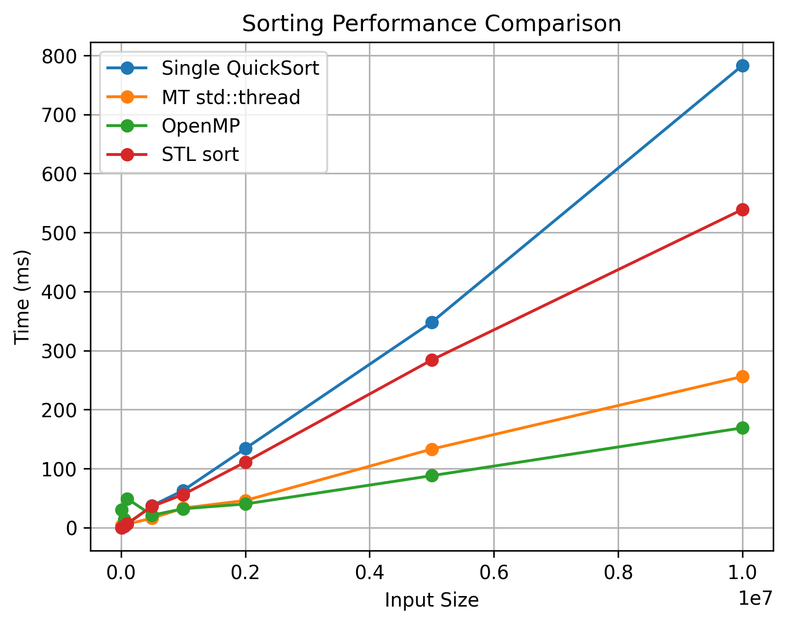

# OMPQ Sort

## 🚀 Parallel QuickSort Benchmark Suite
📌 Overview

This project benchmarks and compares the performance of multiple QuickSort implementations on large randomly generated datasets. It evaluates:

✅ Single-thread QuickSort

✅ Multi-thread QuickSort using std::thread

✅ Parallel QuickSort using OpenMP tasks

✅ (Optional) STL std::sort baseline

The benchmark measures execution time across input sizes ranging from 10⁴ to 10⁷ elements and exports results to CSV for visualization.

## 📊 Benchmark Range

Input sizes tested:

10K → 10M elements

## 🔧 Requirements
### Compiler
g++ (>= 9 recommended)

### Python
Python 3.8+

### Python Packages
pip install pandas matplotlib

### 🧪 Build & Run
Step 1 — Run Benchmark
python benchmark.py

## 📊 Example Visualization

### Graph shows:

Execution time vs input size

Parallel scaling behavior

Overhead impact at small sizes

### 🚀 Optimization Ideas (Future Work)

GPU sorting (CUDA / Thrust)
